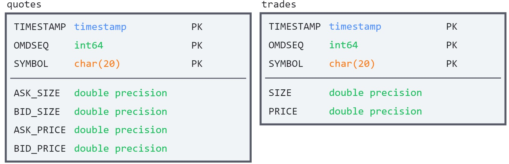
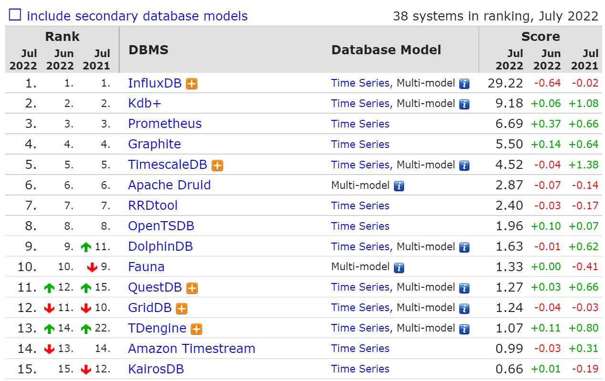

# Исследование производительности no-sql и sql решений для хранения time-series данных

*Цель проекта*: посмотреть на разные подходы для хранения time-series данных, используя sql или no-sql, или же специализированное решение. При этом, интересно оценить перфолента и то как просто решить задачу средствами СУБД можно решить задачу по вычислению простых аналитических запросов.

## Схема данных

Данные устроены очень просто - это записи высокочастотных торгов (точность вплоть до наносекунд) т. н. trades и quotes для различных тикеров по дням. Схема выглядит следующим образом.

Требуется максимально быстро отвечать на различные аналитические запросы.



- **TIMESTAMP** - время продажи *trades* или обновления *quotes*
- **OMDSEQ** - уникальный идентификатор, задающий порядок, в случае если timestamp'ы совпадают
- **SYMBOL** - имя тикера
- **ASK_SIZE** - это количество ценной бумаги, которую маркет-мейкер предлагает продать по цене спроса
- **BID_SIZE** - это количество ценной бумаги, которую маркет-мейкер предлагает купить по цене предложения
- **ASK_PRICE** - цена спроса
- **BID_PRICE** - цена предложения
- **PRICE** - цена сделки
- **SIZE** - размер сделки

## Hardware:

Я использую GPC instance на ssd
|     config   |     value     |
|--------------|:-------------:|
| Machine type | n2-standard-4 |
| vCPU         |       4       |
| Memory       |     16Gb      |


## Запросы:

- Вычисление [The Lee–Ready algorithm](https://doi.org/10.1111/j.1540-6261.1991.tb02683.x), примеры других алгоритмов доступны [здесь](https://github.com/jktis/Trade-Classification-Algorithms)
![Match up a trade with the most recent good quote that is at least X seconds older than the trade — if the trade's price is closer to the ask price, label trade a buy (1); else, if it is closer to the bid price, label it a sell (-1); else, if trade's price is at the mid-quote, then if it is higher than the last trade's price, classify it as a buy (1); else, if it is less, classify it as a sell (-1); else, if it is the same, classify it the same way as the previous trade was classified. If all of these fail, classify the trade as unknown (0).](pictures/lee.jpg)
*Classifying trades bracketed by price continuations.*
```python
LAST_MID_PRICE -> (ASK_PRICE + BID_PRICE) / 2 # at time of last quote tick before given trade
LAST_PRICE -> PRICE # at time of previous trade

if PRICE > LAST_MID_PRICE:
    SIDE = 1
elif PRICE < LAST_MID_PRICE:
    SIDE = -1
else:
    if PRICE > LAST_PRICE:
        SIDE = 1
    elif PRICE < LAST_PRICE:
        SIDE = -1
    else:
        SIDE = 0
```

- Агрегации: средняя price/mid price за один день или VWAP

Все вычисления должны быть сделаны group by **SYMBOL**.
Данные в базы могут быть загружены с помощью [скрипта](scripts/load_data_dbs.py). При этом пример исходных файлов лежит в директории *data*.

## SQL
В качестве SQL решения использую **PostgresSQL**.
И схема двух таблиц **quotes** и **trades** приведена выше.

При этом я создаю индекс для поля **SYMBOL**, поскольку частыми операциями являются группировки по этому полю, либо же join'ы.

Загрузка данных за 1 день заняла примерно 30 минут.

### Агрегация:
```sql
SELECT 
    AVG(price) AS total
FROM 
    trades
GROUP BY
	symbol;
```
Время работы для dataset'a размеров в 100 записей.


## No-SQL
В качесте базы No-SQL используется **MongoDB**.

Создано две коллекции:
- **quotes** с записями из файла **.*_qte.csv**
- **trades** с записями из файла **.*_trd.csv**

### Агрегация:
```js
db.trades.aggregate([
  {
    $group: {
      _id: "$symbol",
      avg: { $avg: "$price" }
    }
  }
])
```
Время работы для dataset'a размеров в 100 записей.


## Time Series Database

Используется база InfluxDB как самое наилучшее решение согласно [рейтингу](https://db-engines.com/en/ranking/time+series+dbms).


*DB-Engines Ranking of Time Series DBMS*

### Агрегация:
```flux
from(bucket:"quotes_trades")
    |> range(start: 0, stop: now())
    |> filter(fn: (r) => r._measurement == "trades" and r._field == "price")
    |> mean()
```
Время работы для dataset'a размеров в 100 записей.

## Результаты

### Замеры времени
Для анализа производительности были загружены данные за 1 день (39Gb заняли csv-файлы).
|                 |Postgres|Mongo|Influx|
|-----------------|:------:|:---:|:----:|
|data loading     |  65m   |   m |   m  |
|aggregation query|        |     |      |
|lee and ready    |        |     |      |
*для кверей считалось среднее время за 10 запусков*

### Общие выводы:

#### Плюсы SQL для хранения временных рядов
- Иерархические данные временных рядов естественным образом сочетаются с реляционными таблицами. 
- Если ременной ряд основан на транзакционных данных, то будет выгодно хранить временные ряды в той же базе данных для удобства проверки, перекрестных ссылок и т.д. Как вариант стоило посмотреть в сторону **Timescale**.

#### Плюсы No-SQL для хранения  временных рядов
- Записи выполняются быстро, поскольку нет нужды перестраивать индексы
- Требование миграции при изменении схемы
- Более производительное готовое решение, потому с меньшей вероятностью можно создать неудобную схему